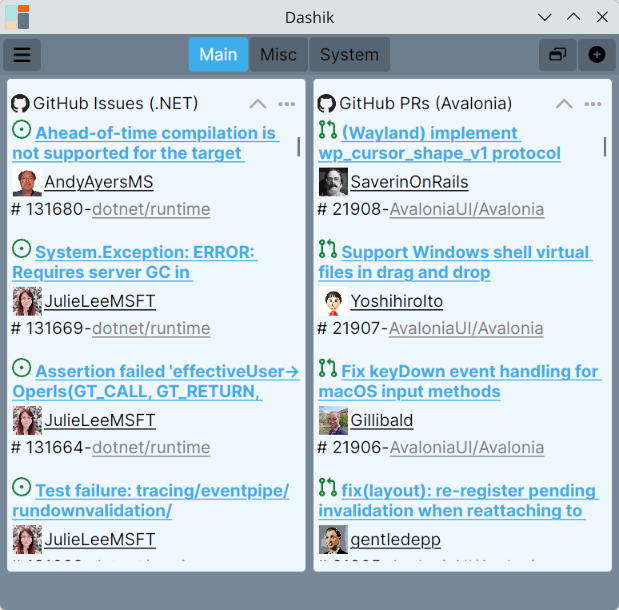
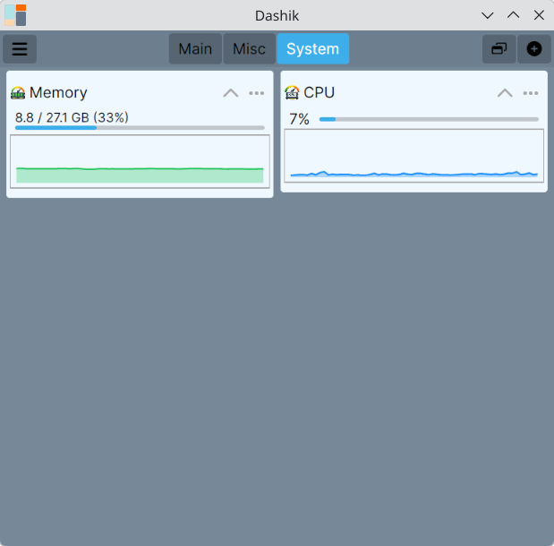
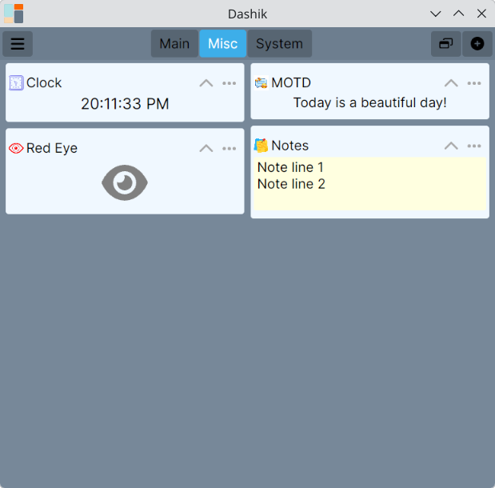
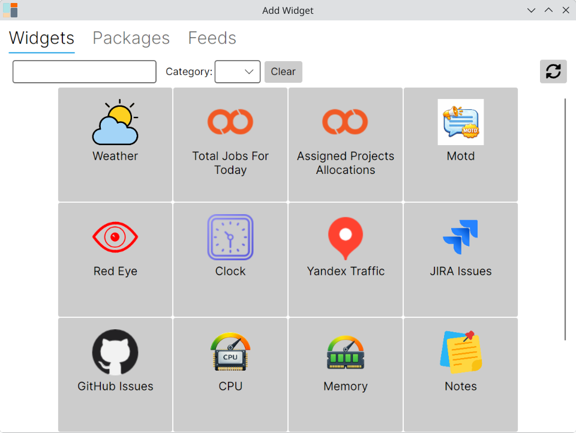

# Dashik

Dashik is a small, local desktop widgets-based dashboard application.

*Note: The project is under development.*

## Features

1. Runs locally on Windows, macOS and Linux.
2. Groups widgets into different spaces (tabs), so you can organize dashboards by topic.
3. Every widget can be configured individually, with settings stored locally.
4. Widgets are installed on demand from a package feed, or built yourself with the [Dashik SDK](docs/sdk.md).
5. Saves window position per display.
6. Lives in the system tray.
7. Can launch on system startup.

## Widgets

Dashik ships with a widget picker where widgets are installed from a package feed. Widgets currently available:

| Widget | Description |
| --- | --- |
| **GitHub Issues** | Shows a list of assigned issues and PRs from GitHub. |
| **JIRA** | Shows issues from JIRA. |
| **CPU** | Shows current CPU usage. |
| **Memory** | Shows current memory usage. |
| **Weather** | Shows current weather. |
| **Yandex Traffic** | Shows Yandex traffic information. |
| **Clock** | Shows current time. |
| **Red Eye** | Reminds you to take a break for your eyes. |
| **Notes** | Lets you jot down and keep quick notes. |
| **Command Output** | Runs a shell command and displays its output. |
| **MOTD** | Shows a message of the day. |

New widgets can be added at any time - either from additional feeds or by writing your own with the [Dashik SDK](docs/sdk.md).

| System widgets | Misc widgets |
| --- | --- |
|  |  |

### Adding a widget

Widgets are added from a searchable, categorized picker:

## Extending Dashik

Widgets are self-contained Avalonia controls with metadata, optional settings, and lifecycle hooks. See the [Dashik SDK documentation](docs/sdk.md) for how to build your own.

## License

Dashik is licensed under the MIT License - see the [LICENSE](LICENSE) file for details.
